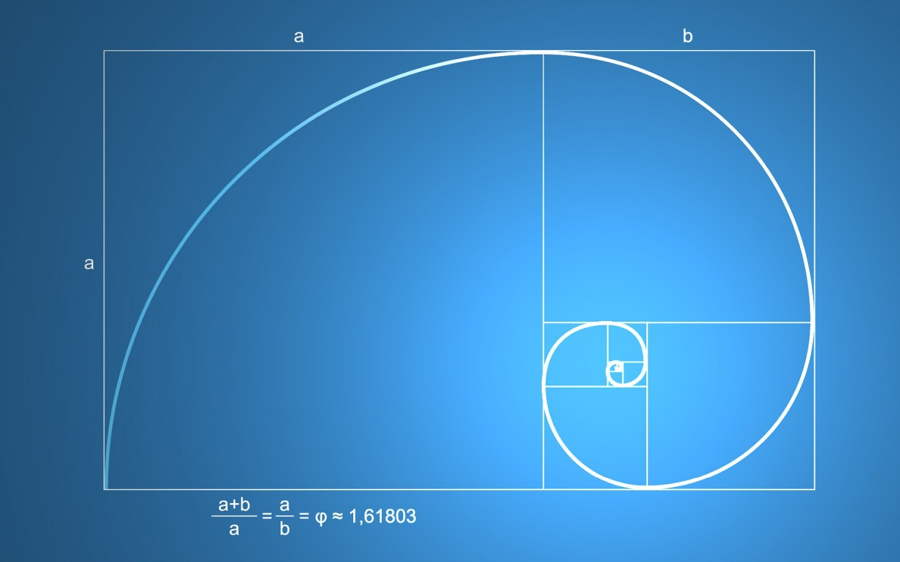

The Fibonacci Sequence is the series of numbers: 0, 1, 1, 2, 3, 5, 8, 13, 21, 34, ...

The next number is found by adding up the two numbers before it:
    -the 2 is found by adding the two numbers before it (1+1),
    -the 3 is found by adding the two numbers before it (1+2),
    -the 5 is (2+3),
and so on!

And here is a surprise. When we take any two successive (one after the other) Fibonacci Numbers, their ratio is very close to the Golden Ratio "φ" which is approximately 1.618034...
In fact, the bigger the pair of Fibonacci Numbers, the closer the approximation.

The spiral shapes of sunflowers and other patterns in nature follow a Fibonacci sequence.

Fibonacci Day is November 23rd, as it has the digits "1, 1, 2, 3" which is part of the sequence. So next Nov 23 let everyone know!

## Topics Covered

1. Fibonacci Sequence
2. Fibonacci Day