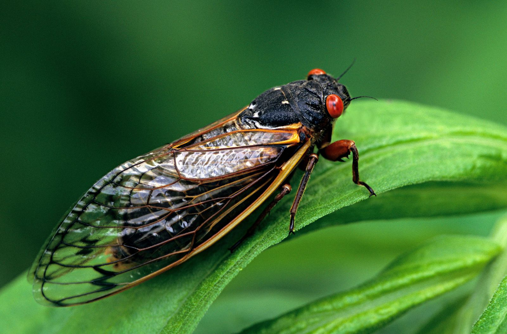

Cicadas incubate underground for long periods of time before coming out to mate. Sometimes they spend 13 years underground, sometimes 17. Why? Both those intervals are prime numbers and biologists now believe cicadas adopted those life-cycles to minimize their contact with predators with more round numbered life-cycles.

## Covered Topics

1. Primes
2. Cicadas