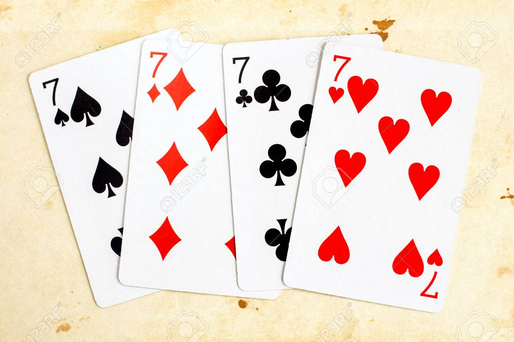

You might have guessed that most people's favorite number is 7 but that's now been proven.

A recent online poll of 3,000 people by Alex Bellos found that around 10% of them chose seven, with three as the runner-up.

That might be because seven has so many favorable connections (seven wonders of the world, pillars of wisdom, seven seas, seven dwarves, seven days, seven colors in the rainbow). But it's also true that seven is "arithmetically unique" - the only single number you can't multiply or divide while keeping the answer within the 1-10 group.

## Covered Topics

1. Number Seven